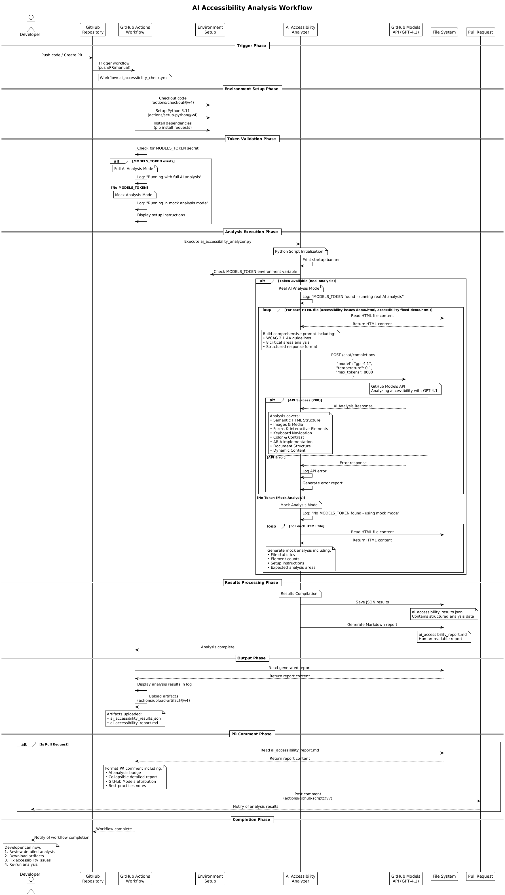

# AI Accessibility Analysis - Detailed Sequence Diagram

## Overview
This sequence diagram illustrates the complete flow of the AI-powered accessibility analysis system, from code push to final report generation.

```plantuml
@startuml AI_Accessibility_Analysis_Sequence
!theme plain
skinparam backgroundColor #FFFFFF
skinparam sequenceMessageAlign center
skinparam participantPadding 10
skinparam boxPadding 10

title AI Accessibility Analysis Workflow

actor Developer as Dev
participant "GitHub\nRepository" as GH
participant "GitHub Actions\nWorkflow" as GHA
participant "Environment\nSetup" as Env
participant "AI Accessibility\nAnalyzer" as Analyzer
participant "GitHub Models\nAPI (GPT-4.1)" as API
participant "File System" as FS
participant "Pull Request" as PR

== Trigger Phase ==
Dev -> GH: Push code / Create PR
GH -> GHA: Trigger workflow\n(push/PR/manual)
note over GHA: Workflow: ai_accessibility_check.yml

== Environment Setup Phase ==
GHA -> Env: Checkout code\n(actions/checkout@v4)
GHA -> Env: Setup Python 3.11\n(actions/setup-python@v4)
GHA -> Env: Install dependencies\n(pip install requests)

== Token Validation Phase ==
GHA -> GHA: Check for MODELS_TOKEN secret

alt MODELS_TOKEN exists
    note over GHA: Full AI Analysis Mode
    GHA -> GHA: Log: "Running with full AI analysis"
else No MODELS_TOKEN
    note over GHA: Mock Analysis Mode
    GHA -> GHA: Log: "Running in mock analysis mode"
    GHA -> GHA: Display setup instructions
end

== Analysis Execution Phase ==
GHA -> Analyzer: Execute ai_accessibility_analyzer.py
note over Analyzer: Python Script Initialization

Analyzer -> Analyzer: Print startup banner
Analyzer -> Env: Check MODELS_TOKEN environment variable

alt Token Available (Real Analysis)
    note over Analyzer: Real AI Analysis Mode
    Analyzer -> Analyzer: Log: "MODELS_TOKEN found - running real AI analysis"
    
    loop For each HTML file (accessibility-issues-demo.html, accessibility-fixed-demo.html)
        Analyzer -> FS: Read HTML file content
        FS --> Analyzer: Return HTML content
        
        note over Analyzer: Build comprehensive prompt including:\n• WCAG 2.1 AA guidelines\n• 8 critical areas analysis\n• Structured response format
        
        Analyzer -> API: POST /chat/completions\n{\n  "model": "gpt-4.1",\n  "temperature": 0.1,\n  "max_tokens": 8000\n}
        
        note over API: GitHub Models API\nAnalyzing accessibility with GPT-4.1
        
        alt API Success (200)
            API --> Analyzer: AI Analysis Response
            note over Analyzer: Analysis covers:\n• Semantic HTML Structure\n• Images & Media\n• Forms & Interactive Elements\n• Keyboard Navigation\n• Color & Contrast\n• ARIA Implementation\n• Document Structure\n• Dynamic Content
        else API Error
            API --> Analyzer: Error response
            Analyzer -> Analyzer: Log API error
            Analyzer -> Analyzer: Generate error report
        end
    end
    
else No Token (Mock Analysis)
    note over Analyzer: Mock Analysis Mode
    Analyzer -> Analyzer: Log: "No MODELS_TOKEN found - using mock mode"
    
    loop For each HTML file
        Analyzer -> FS: Read HTML file content
        FS --> Analyzer: Return HTML content
        
        note over Analyzer: Generate mock analysis including:\n• File statistics\n• Element counts\n• Setup instructions\n• Expected analysis areas
    end
end

== Results Processing Phase ==
note over Analyzer: Results Compilation

Analyzer -> FS: Save JSON results
note over FS: ai_accessibility_results.json\nContains structured analysis data

Analyzer -> FS: Generate Markdown report
note over FS: ai_accessibility_report.md\nHuman-readable report

Analyzer --> GHA: Analysis complete

== Output Phase ==
GHA -> FS: Read generated report
FS --> GHA: Return report content

GHA -> GHA: Display analysis results in log

GHA -> GHA: Upload artifacts\n(actions/upload-artifact@v4)
note over GHA: Artifacts uploaded:\n• ai_accessibility_results.json\n• ai_accessibility_report.md

== Completion Phase ==
GHA --> GH: Workflow complete
GH --> Dev: Notify of workflow completion

note over Dev: Developer can now:\n1. Review detailed analysis\n2. Download artifacts\n3. Fix accessibility issues\n4. Re-run analysis

@enduml
```

## Detailed Component Breakdown

### 1. Workflow Triggers
- **Push Events**: main/master branch pushes
- **Pull Request Events**: PR creation/updates to main/master
- **Manual Dispatch**: workflow_dispatch for on-demand execution

### 2. Environment Setup
- **Ubuntu Latest**: Consistent Linux environment
- **Python 3.11**: Modern Python with full feature support
- **Dependencies**: Minimal - only `requests` for API calls

### 3. Token Management
- **Optional MODELS_TOKEN**: Graceful degradation without token
- **Security**: Token accessed via GitHub Secrets
- **Flexibility**: Works in both authenticated and mock modes

### 4. Analysis Engine (ai_accessibility_analyzer.py)

#### Core Functions:
- `call_github_models()`: Handles API communication
- `mock_analysis()`: Provides fallback analysis
- `analyze_html_file()`: Processes individual HTML files
- `main()`: Orchestrates the entire analysis process

#### Analysis Scope:
1. **Semantic HTML Structure**: Heading hierarchy, landmarks, semantic tags
2. **Images & Media**: Alt text quality, decorative vs informative images
3. **Forms & Interactive Elements**: Labels, fieldsets, error handling
4. **Keyboard Navigation**: Tab order, focus indicators, skip links
5. **Color & Contrast**: WCAG compliance, color-only information
6. **ARIA Implementation**: Proper attributes, roles, states
7. **Document Structure**: Language attributes, meta information
8. **Dynamic Content**: Live regions, status updates

### 5. Output Generation
- **JSON Results**: Machine-readable structured data
- **Markdown Report**: Human-readable formatted analysis
- **GitHub Artifacts**: Persistent storage of results

### 6. Error Handling
- **API Timeouts**: 60-second timeout for stability
- **File Not Found**: Graceful handling of missing files
- **Token Issues**: Clear messaging and fallback options
- **Network Errors**: Comprehensive error reporting

## Integration Points

### GitHub Actions Integration
- Permissions: `contents:read`, `pull-requests:write`, `issues:write`
- Artifacts: Automatic upload and retention
- Comments: Automated PR feedback

### GitHub Models API Integration
- Model: GPT-4.1 for advanced reasoning
- Temperature: 0.1 for consistent, focused analysis
- Max Tokens: 8000 for comprehensive responses
- Authentication: Bearer token via environment variable

### File System Integration
- Input: HTML files for analysis
- Output: JSON and Markdown reports
- Encoding: UTF-8 for international character support

## Usage Patterns

### For Developers
1. **Push Code**: Automatic analysis on push/PR
3. **Download Reports**: Access detailed artifacts
4. **Fix Issues**: Implement recommended changes
5. **Iterate**: Re-run analysis after fixes

### For Teams
1. **Consistent Standards**: Automated accessibility checks
2. **Educational Tool**: Learn from AI recommendations
3. **Quality Gates**: Prevent accessibility regressions
4. **Documentation**: Historical analysis records

This sequence diagram represents a comprehensive, production-ready accessibility analysis system that combines AI intelligence with practical CI/CD integration.
