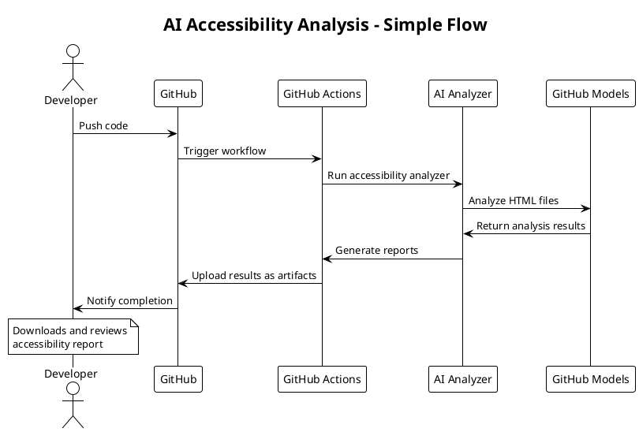

# Simple AI Accessibility Analysis Flow

This diagram shows the basic flow of the AI accessibility analysis system.

## What it does:

1. **Developer pushes code** to GitHub
2. **GitHub Actions runs** the accessibility workflow
3. **AI Analyzer reads** HTML files in the project
4. **GitHub Models API** analyzes the files for accessibility issues
5. **Reports are generated** in JSON and Markdown formats
6. **Results are uploaded** as downloadable artifacts
7. **Developer gets notified** and can review the accessibility report

## Key Benefits:
- ✅ Automatic accessibility checking
- ✅ AI-powered analysis using GPT-4
- ✅ Works on every code push
- ✅ Generates detailed reports
- ✅ No manual setup required
